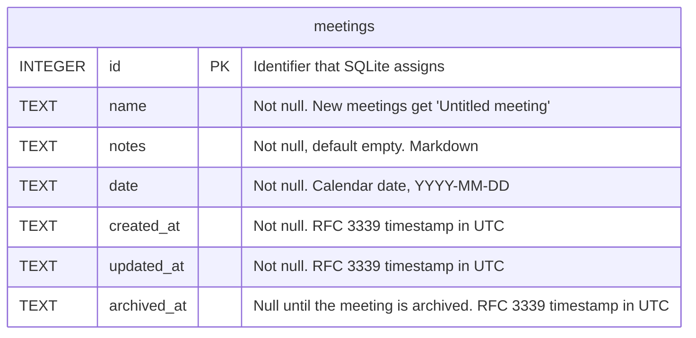

# Data model

This document shows the structure of the SQLite database that the backend owns. The database is the file `gps.sqlite` in the application data directory. The migrations in `MIGRATIONS` in `src-tauri/src/db.rs` define the structure. When you add a migration that changes the structure, update this diagram in the same change.

## Tables

### `meetings`

Each row is one meeting and its notes. The database has no other tables yet, so there are no relationships.

- `notes` holds the notes as Markdown (see ADR 0004).
- `archived_at` is empty for a meeting that is not archived. When the user archives a meeting, the backend sets it to the current time (see ADR 0008). When the user restores the meeting, the backend clears it again. The list of meetings shows only the meetings where `archived_at` is empty.
- The backend sets `created_at` and `updated_at`. It changes `updated_at` each time the name, date, or notes change. Archiving and restoring do not change `updated_at`.
