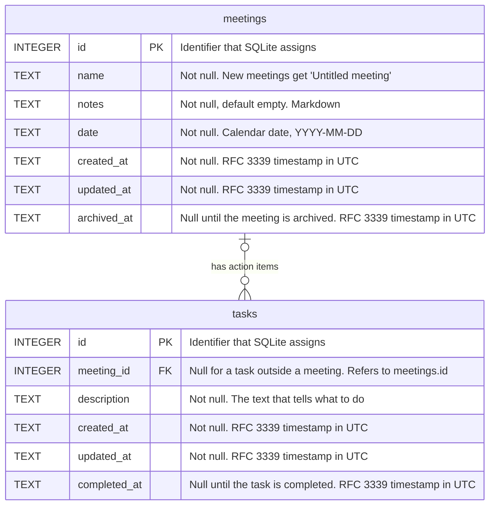

# Data model

This document shows the structure of the SQLite database that the backend owns. The database is the file `gps.sqlite` in the application data directory. The migrations in `MIGRATIONS` in `src-tauri/src/db.rs` define the structure. When you add a migration that changes the structure, update this diagram in the same change.

## Tables

### `meetings`

Each row is one meeting and its notes. A meeting can have many tasks, which are its action items.

- `notes` holds the notes as Markdown (see ADR 0004).
- `archived_at` is empty for a meeting that is not archived. When the user archives a meeting, the backend sets it to the current time (see ADR 0008). When the user restores the meeting, the backend clears it again. The list of meetings shows only the meetings where `archived_at` is empty.
- The backend sets `created_at` and `updated_at`. It changes `updated_at` each time the name, date, or notes change. Archiving and restoring do not change `updated_at`.

### `tasks`

Each row is one task that the user must do, such as an action item from a meeting (see ADR 0010).

- `meeting_id` refers to the meeting that the task comes from. It may be empty for a task outside a meeting, but the application does not create such tasks yet. An index on `meeting_id` makes it fast to find the tasks of a meeting.
- `completed_at` is empty for a task that is not completed. When the user checks the task off, the backend sets it to the current time. If the user checks off a task that is already completed, the backend keeps the time that was recorded first. When the user unchecks the task, the backend clears it again.
- The backend sets `created_at` and `updated_at`. It changes `updated_at` each time the description changes or the task is checked off or unchecked.
- Archiving a meeting does not change its tasks.
- The database enforces foreign keys, so `meeting_id` must refer to a meeting that exists.
