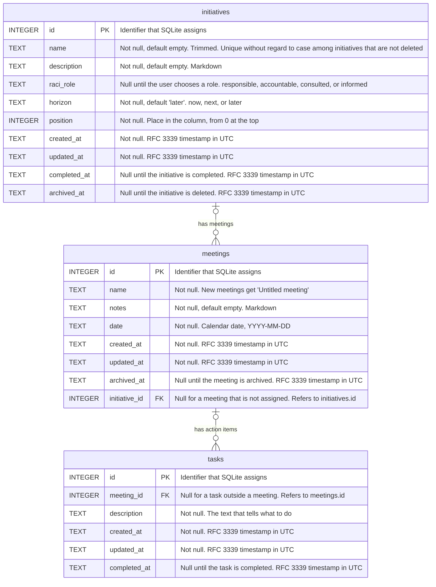

# Data model

This document shows the structure of the SQLite database that the backend owns. The database is the file `gps.sqlite` in the application data directory. The migrations in `MIGRATIONS` in `src-tauri/src/db.rs` define the structure. When you add a migration that changes the structure, update this diagram in the same change. `target-data-model.md` describes the model that the application is expected to grow into.

```mermaid
erDiagram
    meetings {
        INTEGER id PK "Identifier that SQLite assigns"
        TEXT name "Not null. New meetings get 'Untitled meeting'"
        TEXT notes "Not null, default empty. Markdown"
        TEXT date "Not null. Calendar date, YYYY-MM-DD"
        TEXT created_at "Not null. RFC 3339 timestamp in UTC"
        TEXT updated_at "Not null. RFC 3339 timestamp in UTC"
        TEXT archived_at "Null until the meeting is archived. RFC 3339 timestamp in UTC"
        INTEGER initiative_id FK "Null for a meeting that is not assigned. Refers to initiatives.id"
    }
    tasks {
        INTEGER id PK "Identifier that SQLite assigns"
        INTEGER meeting_id FK "Null for a task outside a meeting. Refers to meetings.id"
        TEXT description "Not null. The text that tells what to do"
        TEXT created_at "Not null. RFC 3339 timestamp in UTC"
        TEXT updated_at "Not null. RFC 3339 timestamp in UTC"
        TEXT completed_at "Null until the task is completed. RFC 3339 timestamp in UTC"
    }
    initiatives {
        INTEGER id PK "Identifier that SQLite assigns"
        TEXT name "Not null, default empty. Trimmed. Unique without regard to case among initiatives that are not deleted"
        TEXT description "Not null, default empty. Markdown"
        TEXT raci_role "Null until the user chooses a role. responsible, accountable, consulted, or informed"
        TEXT horizon "Not null, default 'later'. now, next, or later"
        INTEGER position "Not null. Place in the column, from 0 at the top"
        TEXT created_at "Not null. RFC 3339 timestamp in UTC"
        TEXT updated_at "Not null. RFC 3339 timestamp in UTC"
        TEXT completed_at "Null until the initiative is completed. RFC 3339 timestamp in UTC"
        TEXT archived_at "Null until the initiative is deleted. RFC 3339 timestamp in UTC"
    }
    meetings |o--o{ tasks : "has action items"
    initiatives |o--o{ meetings : "has meetings"
```

## Tables

### `meetings`

Each row is one meeting and its notes. A meeting can have many tasks, which are its action items.

- `notes` holds the notes as Markdown (see ADR 0004).
- `archived_at` is empty for a meeting that is not archived. When the user archives a meeting, the backend sets it to the current time (see ADR 0008). When the user restores the meeting, the backend clears it again. The list of meetings shows only the meetings where `archived_at` is empty.
- The backend sets `created_at` and `updated_at`. It changes `updated_at` each time the name, date, or notes change. Archiving and restoring do not change `updated_at`.
- `initiative_id` refers to the initiative that the meeting is assigned to (see ADR 0013). It is empty for a meeting that is not assigned. A meeting is assigned to at most one initiative, which can be completed or deleted. When the user assigns the meeting or removes the assignment, the backend changes `updated_at`. Saving the name, date, or notes does not change `initiative_id`. An index on `initiative_id` makes it fast to find the meetings of an initiative. The database enforces foreign keys, so `initiative_id` must refer to an initiative that exists.

### `initiatives`

Each row is one company initiative that the user has a responsibility in, such as a product launch or a migration, and its place on the roadmap (see ADR 0013). An initiative can have many meetings.

- `name` is stored without spaces at the start or the end. An initiative can have an empty name, when the user saved a draft that has a role or a description but no name. The user interface shows "Untitled initiative" for it. The unique index `initiatives_name` on `name COLLATE NOCASE`, limited to rows where `archived_at` is empty and `name` is not empty, makes sure that no two initiatives that are not deleted have the same name. Uppercase and lowercase letters A to Z do not count, so "Launch" and "launch" are the same name. Any number of initiatives can have an empty name, and a deleted initiative gives its name free. Completed initiatives keep their names.
- `description` holds the description as Markdown, like the notes of a meeting.
- `raci_role` is the role of the user in the initiative, from the RACI model. It is empty until the user chooses a role. A `CHECK` constraint accepts only the four lowercase values `responsible`, `accountable`, `consulted`, and `informed`. The backend also checks the value before it writes it.
- `horizon` is the column of the roadmap: `now`, `next`, or `later`. A `CHECK` constraint accepts only these values. Done is not a value of `horizon`: an initiative is in Done when `completed_at` is set.
- `position` is the place of the initiative in its column, from 0 at the top. An initiative is on the board when both `completed_at` and `archived_at` are empty. In each column, the initiatives on the board have the positions 0 to n - 1, with no gap and no repeated number. The backend keeps this rule inside one transaction each time it creates, moves, completes, reopens, deletes, or restores an initiative. A completed or deleted initiative keeps the `horizon` and `position` that it had last, so these values match the board only for initiatives on the board. The database does not enforce this rule with an index. An index on `(horizon, position)` makes it fast to read a column in order.
- `completed_at` is empty for an initiative that is not completed. When the user moves the initiative to Done, the backend sets it to the current time, and keeps the time that was recorded first if the initiative is already completed. When the user moves the initiative out of Done, the backend clears it again.
- `archived_at` is empty for an initiative that is not deleted. The user interface says "Delete", but the row is kept, so that the delete can be undone and assigned meetings keep their link. When the user restores the initiative, the backend clears `archived_at`, unless another initiative that is not deleted now has the same name.
- The backend sets `created_at` and `updated_at`. It changes `updated_at` each time the name, the description, or the role changes. Moving, completing, deleting, and restoring do not change `updated_at`.

### `tasks`

Each row is one task that the user must do, such as an action item from a meeting (see ADR 0010).

- `meeting_id` refers to the meeting that the task comes from. It may be empty for a task outside a meeting, but the application does not create such tasks yet. An index on `meeting_id` makes it fast to find the tasks of a meeting.
- `completed_at` is empty for a task that is not completed. When the user checks the task off, the backend sets it to the current time. If the user checks off a task that is already completed, the backend keeps the time that was recorded first. When the user unchecks the task, the backend clears it again.
- The backend sets `created_at` and `updated_at`. It changes `updated_at` each time the description changes or the task is checked off or unchecked.
- Archiving a meeting does not change its tasks.
- The database enforces foreign keys, so `meeting_id` must refer to a meeting that exists.
