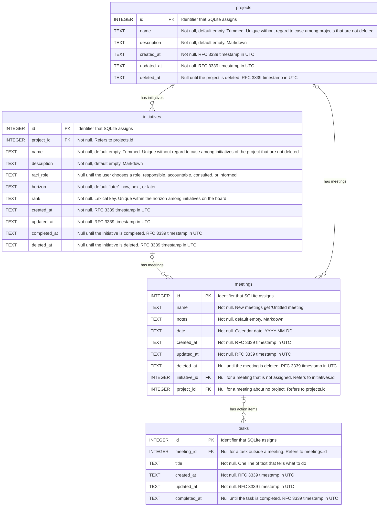

# Data model

This document shows the structure of the SQLite database that the backend owns. The database is the file `gps.sqlite` in the application data directory. The migrations in `MIGRATIONS` in `src-tauri/src/db.rs` define the structure. When you add a migration that changes the structure, update this diagram in the same change. `target-data-model.md` describes the model that the application is expected to grow into.

```mermaid
erDiagram
    meetings {
        INTEGER id PK "Identifier that SQLite assigns"
        TEXT name "Not null. New meetings get 'Untitled meeting'"
        TEXT notes "Not null, default empty. Markdown"
        TEXT date "Not null. Calendar date, YYYY-MM-DD"
        TEXT created_at "Not null. RFC 3339 timestamp in UTC"
        TEXT updated_at "Not null. RFC 3339 timestamp in UTC"
        TEXT deleted_at "Null until the meeting is deleted. RFC 3339 timestamp in UTC"
        INTEGER initiative_id FK "Null for a meeting that is not assigned. Refers to initiatives.id"
        INTEGER project_id FK "Null for a meeting about no project. Refers to projects.id"
    }
    tasks {
        INTEGER id PK "Identifier that SQLite assigns"
        INTEGER meeting_id FK "Null for a task outside a meeting. Refers to meetings.id"
        TEXT title "Not null. One line of text that tells what to do"
        TEXT created_at "Not null. RFC 3339 timestamp in UTC"
        TEXT updated_at "Not null. RFC 3339 timestamp in UTC"
        TEXT completed_at "Null until the task is completed. RFC 3339 timestamp in UTC"
    }
    initiatives {
        INTEGER id PK "Identifier that SQLite assigns"
        INTEGER project_id FK "Not null. Refers to projects.id"
        TEXT name "Not null, default empty. Trimmed. Unique without regard to case among initiatives of the project that are not deleted"
        TEXT description "Not null, default empty. Markdown"
        TEXT raci_role "Null until the user chooses a role. responsible, accountable, consulted, or informed"
        TEXT horizon "Not null, default 'later'. now, next, or later"
        TEXT rank "Not null. Lexical key. Unique within the horizon among initiatives on the board"
        TEXT created_at "Not null. RFC 3339 timestamp in UTC"
        TEXT updated_at "Not null. RFC 3339 timestamp in UTC"
        TEXT completed_at "Null until the initiative is completed. RFC 3339 timestamp in UTC"
        TEXT deleted_at "Null until the initiative is deleted. RFC 3339 timestamp in UTC"
    }
    projects {
        INTEGER id PK "Identifier that SQLite assigns"
        TEXT name "Not null, default empty. Trimmed. Unique without regard to case among projects that are not deleted"
        TEXT description "Not null, default empty. Markdown"
        TEXT created_at "Not null. RFC 3339 timestamp in UTC"
        TEXT updated_at "Not null. RFC 3339 timestamp in UTC"
        TEXT deleted_at "Null until the project is deleted. RFC 3339 timestamp in UTC"
    }
    meetings |o--o{ tasks : "has action items"
    initiatives |o--o{ meetings : "has meetings"
    projects ||--o{ initiatives : "has initiatives"
    projects |o--o{ meetings : "has meetings"
```

## Tables

### `meetings`

Each row is one meeting and its notes. A meeting can have many tasks, which are its action items. A meeting is about one project or about no project.

- `notes` holds the notes as Markdown (see ADR 0004).
- `deleted_at` is empty for a meeting that is not deleted. When the user deletes a meeting, the backend sets it to the current time (see ADR 0008). The row stays in the database, so that the delete can be undone and the tasks of the meeting keep their link. When the user restores the meeting, the backend clears `deleted_at` again. The list of meetings shows only the meetings where `deleted_at` is empty. ADR 0017 gave the column its name.
- The backend sets `created_at` and `updated_at`. It changes `updated_at` each time the name, date, or notes change. Deleting and restoring do not change `updated_at`.
- `initiative_id` refers to the initiative that the meeting is assigned to (see ADR 0013). It is empty for a meeting that is not assigned. A meeting is assigned to at most one initiative, which can be completed or deleted. When the user assigns the meeting or removes the assignment, the backend changes `updated_at`. Saving the name, date, or notes does not change `initiative_id`. An index on `initiative_id` makes it fast to find the meetings of an initiative. The database enforces foreign keys, so `initiative_id` must refer to an initiative that exists. When the user assigns the meeting to an initiative, the backend also sets `project_id` to the project of that initiative.
- `project_id` refers to the project that the meeting is about (see ADR 0019). It is empty for a meeting about no project, such as a 1:1. If the meeting is assigned to an initiative, `project_id` is the project of that initiative. The backend keeps this rule: when the user changes the project of the meeting, the backend clears `initiative_id` and changes `updated_at`. Setting the project that the meeting already has changes nothing. The backend refuses to set a deleted project, but a meeting keeps a project that is deleted after it was set, so that the delete of the project can be undone. When an initiative moves to another project, its meetings move with it. The migration that added the column gave each meeting that was assigned to an initiative the project of that initiative. An index on `project_id` makes it fast to find the meetings of a project.

### `initiatives`

Each row is one company initiative that the user has a responsibility in, such as a product launch or a migration, and its place on the roadmap (see ADR 0013). An initiative belongs to one project and can have many meetings.

- `project_id` refers to the project that the initiative belongs to (see ADR 0019). It is never empty. The backend refuses to create an initiative in a deleted project or to move one there, and refuses to restore a deleted initiative whose project is deleted, so every initiative that is not deleted belongs to a project that is not deleted. The user can move an initiative to another project. The move changes `updated_at`, moves the meetings of the initiative too, and does not change `horizon` or `rank`. The migration that added the column put every initiative that existed then in a new project named "Unsorted". It created that project only if there was at least one initiative. The index `initiatives_project_id` makes it fast to find the initiatives of a project, also the deleted ones and the ones with an empty name.
- `name` is stored without spaces at the start or the end. An initiative can have an empty name, when the user saved a draft that has a role or a description but no name. The user interface shows "Untitled initiative" for it. The unique index `initiatives_name` on `(project_id, name COLLATE NOCASE)`, limited to rows where `deleted_at` is empty and `name` is not empty, makes sure that no two initiatives of one project that are not deleted have the same name. Two projects can each have an initiative with the same name. Uppercase and lowercase letters A to Z do not count, so "Launch" and "launch" are the same name. Any number of initiatives can have an empty name, and a deleted initiative gives its name free. Completed initiatives keep their names.
- `description` holds the description as Markdown, like the notes of a meeting.
- `raci_role` is the role of the user in the initiative, from the RACI model. It is empty until the user chooses a role. A `CHECK` constraint accepts only the four lowercase values `responsible`, `accountable`, `consulted`, and `informed`. The backend also checks the value before it writes it.
- `horizon` is the column of the roadmap: `now`, `next`, or `later`. A `CHECK` constraint accepts only these values. Done is not a value of `horizon`: an initiative is in Done when `completed_at` is set.
- `rank` is a text key that gives the place of the initiative in its column (see ADR 0017). A key is made only of the lowercase hexadecimal digits `0` to `9` and `a` to `f`, it is never empty, and its last digit is never `0`. The initiatives of a column sort from the top in the order of their ranks, compared as text, character by character. For any two keys, there is a key that sorts between them, so a move gives a new key only to the moved initiative, and no other row changes. Only the backend makes keys. An initiative is on the board when both `completed_at` and `deleted_at` are empty. In each column, no two initiatives on the board have the same rank. The unique index `initiatives_horizon_rank` on `(horizon, rank)`, limited to the initiatives on the board, enforces this rule and makes it fast to read a column in order. A completed or deleted initiative keeps the `horizon` and `rank` that it had last, so these values match the board only for initiatives on the board. When a deleted initiative that is not completed is restored, it keeps its rank if no initiative on the board in its column has that rank. Otherwise, it gets a key between that rank and the next rank in the column, so it appears directly after the initiative that has its old rank.
- `completed_at` is empty for an initiative that is not completed. When the user moves the initiative to Done, the backend sets it to the current time, and keeps the time that was recorded first if the initiative is already completed. When the user moves the initiative out of Done, the backend clears it again.
- `deleted_at` is empty for an initiative that is not deleted. When the user deletes an initiative, the backend sets it to the current time. The row stays in the database, so that the delete can be undone and assigned meetings keep their link. When the user restores the initiative, the backend clears `deleted_at`, unless another initiative of the project that is not deleted now has the same name, or the project is deleted. ADR 0017 gave the column its name.
- The backend sets `created_at` and `updated_at`. It changes `updated_at` each time the name, the description, the role, or the project changes. Moving, completing, deleting, and restoring do not change `updated_at`.

### `projects`

Each row is one project, a long lived effort of the company, such as a product area (see ADR 0019). A project can have many initiatives and many meetings.

- `name` is stored without spaces at the start or the end. A project can have an empty name, when the user saved a draft that has a description but no name. The user interface shows "Untitled project" for it. The unique index `projects_name` on `name COLLATE NOCASE`, limited to rows where `deleted_at` is empty and `name` is not empty, makes sure that no two projects that are not deleted have the same name. Uppercase and lowercase letters A to Z do not count, so "Checkout" and "checkout" are the same name. Any number of projects can have an empty name, and a deleted project gives its name free.
- `description` holds the description as Markdown, like the notes of a meeting.
- `deleted_at` is empty for a project that is not deleted. When the user deletes a project, the backend sets it to the current time, and keeps the time that was recorded first if the project is already deleted. The backend refuses to delete a project that has an initiative that is not deleted, also a completed one. The row stays in the database, so that the delete can be undone, and the meetings about the project keep their `project_id`. When the user restores the project, the backend clears `deleted_at`, unless another project that is not deleted now has the same name.
- The backend sets `created_at` and `updated_at`. It changes `updated_at` each time the name or the description changes. Deleting and restoring do not change `updated_at`.

### `tasks`

Each row is one task that the user must do, such as an action item from a meeting (see ADR 0010).

- `title` is the one line of text that tells what to do. ADR 0018 gave the column its name.

- `meeting_id` refers to the meeting that the task comes from. It may be empty for a task outside a meeting, but the application does not create such tasks yet. An index on `meeting_id` makes it fast to find the tasks of a meeting.
- `completed_at` is empty for a task that is not completed. When the user checks the task off, the backend sets it to the current time. If the user checks off a task that is already completed, the backend keeps the time that was recorded first. When the user unchecks the task, the backend clears it again.
- The backend sets `created_at` and `updated_at`. It changes `updated_at` each time the title changes or the task is checked off or unchecked.
- Deleting a meeting does not change its tasks.
- The database enforces foreign keys, so `meeting_id` must refer to a meeting that exists.
