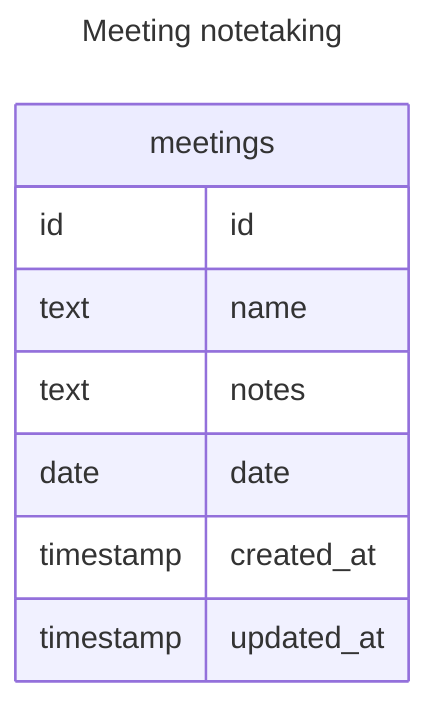

# Take meeting notes

## Situation

When I am attending a meeting

## Motivation

I want to be able to take notes using a rich text editor

## Outcome

So I can recall and reference what was discussed and capture any action items that I've been given in the course of the meeting

## Acceptance criteria

- I can see a list of notes
- I can click a button to create a new note
- The note editor uses the TipTap editor for the editing interface
- The note gets stored as Markdown in the database
- Data is stored in a SQLite file that's kept in the application data directory

## Draft data model

