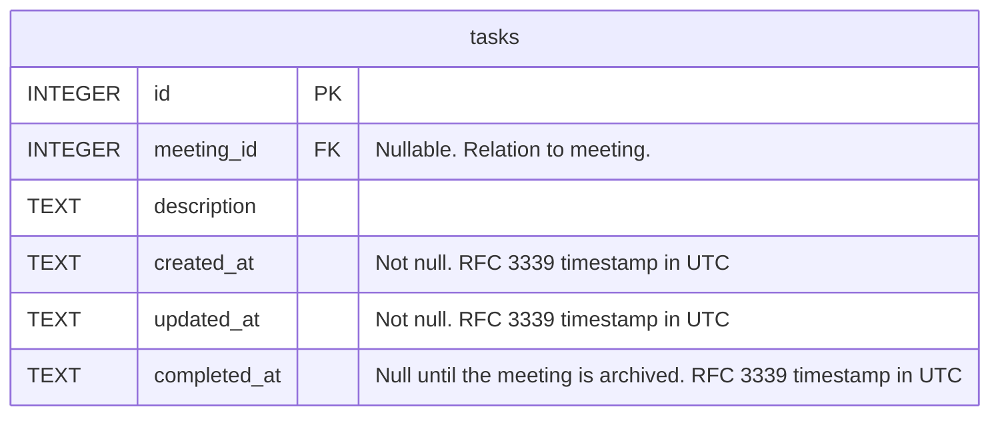

# Meeting action items

## Situation

When I am writing my meeting notes

## Motivation

I want to be able to record the action items that I have been assigned in the course of that meeting

## Outcome

So I can keep track of the work I need to complete

## Acceptance criteria

- Action items (tasks) can be added, removed, and marked as complete within a new right-hand sidebar on the meeting screen
- Action items (tasks) are represented as a checklist
- When an action item (task) is checked off, its text is grayed out

## Draft data model

