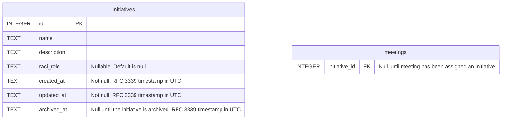

# Managing initiatives

## Situation

When I am assigned a responsibility in a company initiative

## Motivation

I want to record that initiative and my role in it

## Outcome

So that I can always easily reference my current responsibilities within the company
So that I can track my contributions towards the initiative's completion
So that I can connect my completed work back to my (OKR) objectives for the calendar year
So that I can demonstrate my value to the company

## Acceptance criteria

- I can see a list of initiatives
- I can click a button to create a new initiative
- The initiative editor uses the TipTap editor for the editing interface
- The initiative's description gets stored as Markdown in the database
- Meetings can be assigned to an initiative via a select box in its sidebar

## Draft data model

