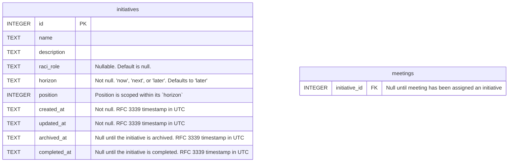

# Managing initiatives

## Situation

When I am assigned a responsibility in a company initiative

## Motivation

I want to record that initiative and my role in it and see how my initiatives are sequenced: what I am doing now, next, and later

## Outcome

So that I can always easily reference my current responsibilities within the company
So that I can track my contributions towards the initiative's completion
So that I can connect my completed work back to my (OKR) objectives for the calendar year
So that I can demonstrate my value to the company
So that I can prioritize my work based on the company's roadmap priorities

## Acceptance criteria

- I can see my initiatives on a roadmap with three columns: Now, Next, and Later, which each initiative represented as a Kanban-style card in a column.
- When I create an initiative, it starts in the "Later" column"
- I can drag and drop initiative cards between the columns
- I can drag and drop initiative cards relative to each other within a column
- I edit an initiative in a shadcn Sheet
- The initiative editor uses the TipTap editor for the initiative description
- The initiative's description gets stored as Markdown in the database
- An initiative leaves the roadmap by either being archived or marked complete
- Meetings can be assigned to an initiative via a select box in its sidebar

## Draft data model

