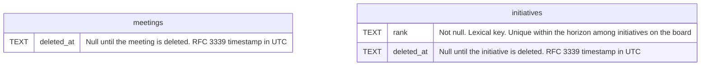

# Deleted rows and ranked order

## Situation

When I, as the application developer, extend the application toward the target data model (projects, meetings that cover several initiatives, a backlog of tasks), and each new table needs a way to delete rows with undo and a way to keep an order that I set by dragging

## Motivation

I want the existing tables to use the same conventions that the new tables will use: a `deleted_at` column for rows that I deleted, and a `rank` column for rows that I order by dragging

## Outcome

So that every table follows one set of rules, and I don't carry two names for deleting and two schemes for ordering
So that the database, and not only the backend code, prevents two initiatives from holding the same place in a column
So that moving a card writes one row instead of renumbering its whole column

## Acceptance criteria

- The terminology in the UI needs to be updated. Instances of "Archive" should be replaced with "Delete" .
- The `archived_at` columns of `meetings` and `initiatives` are named `deleted_at`. The backend commands, the frontend functions, and the fields that the frontend receives follow the new name (for example `delete_meeting`, `restore_meeting`, `deletedAt`, `includeDeleted`).
- `initiatives.position` is replaced by `rank`, a text column that holds a lexical key (fractional indexing), as `docs/target-data-model.md` describes.
- The migration keeps the order that each column of the roadmap has today.
- The frontend still reports a move as a destination and the index of the drop. It never computes rank keys.
- A move writes only the initiative that moved.
- The database rejects two initiatives on the board with the same rank in the same horizon.
- A deleted or completed initiative keeps its horizon and rank. When I restore or reopen it, it returns to the place it held. If another initiative has taken that rank, it goes directly after that initiative.
- `docs/data-model.md` shows the new columns.

## Draft data model

