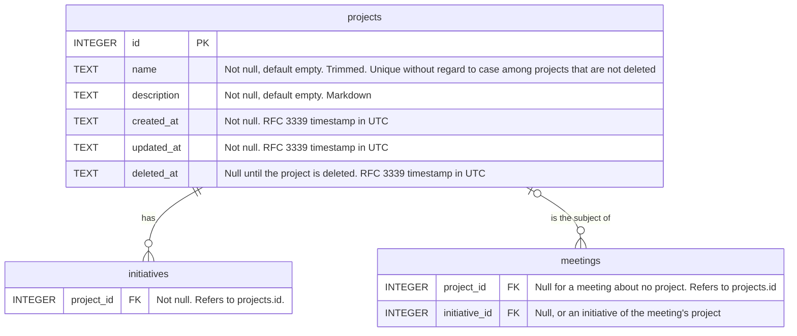

# Projects

## Situation

When I work on a few long lived projects of the company, and my initiatives and meetings each relate to one of them

## Motivation

I want to record my projects, place each initiative in its project, and say which project a meeting was about

## Outcome

So that I can see everything I have recorded about a project in one place
So that I can filter my roadmap to one project when I think about that project's priorities
So that I can record meetings about a young project before it has any initiatives
So that two projects can each have an initiative with the same name, such as "Launch"

## Acceptance criteria

- A new Projects section in the sidebar lists my projects.
- I can create, rename, and delete a project. Deleting can be undone, as it can for meetings and initiatives.
- A project has a name and a description. I edit the description in the same Markdown editor that meetings and initiatives use.
- Two projects that are not deleted cannot have the same name
- Deleting a project that still has initiatives is refused
- A project page shows the project's description, its initiatives, and the meetings about it. From the page I can open each initiative and each meeting.
- Every initiative belongs to one project.
- The name of an initiative is unique within its project instead of across all initiatives.
- The roadmap stays one board across all projects. Each card shows the name of its project, and I can filter the board to one project.
- A meeting can be about one project or about no project. I choose it in the meeting's sidebar.
- The meeting's initiative select offers only the initiatives of the meeting's project. When the meeting has no project, it offers none.
- When I change the project of a meeting, its initiative is cleared if the initiative belongs to the old project.
- A meeting with an initiative gets the project of that initiative.
- `docs/data-model.md` shows the new table and columns.

## Draft data model

