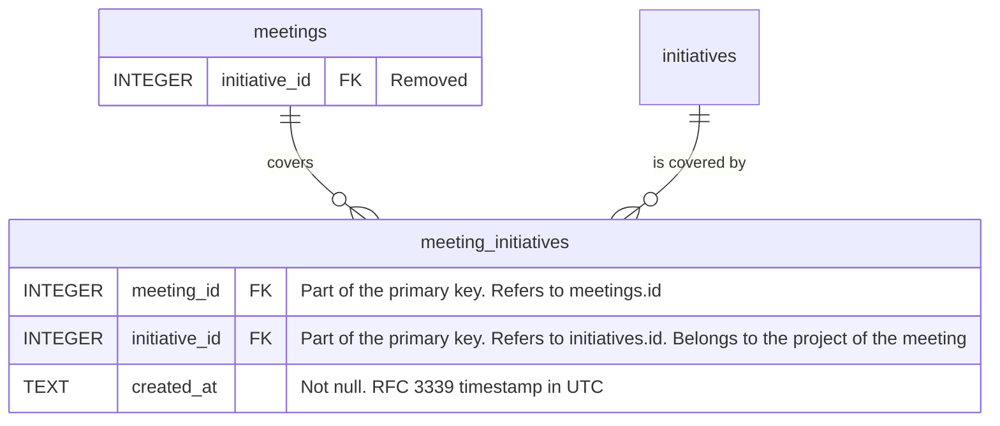

# Meetings that cover several initiatives

## Situation

When a meeting about a project touches more than one of its initiatives, such as a weekly project sync that reviews the launch, the migration, and the pilot

## Motivation

I want to record every initiative that the meeting covered, not only one of them

## Outcome

So that the notes of the meeting are found from each initiative that it covered
So that I do not have to choose the one initiative that a meeting was "most" about
So that the record of an initiative is complete when I look back at what was discussed about it

## Acceptance criteria

- In the meeting's sidebar, I can choose any number of initiatives for the meeting, including none, in place of the one initiative that I choose today.
- The choices are only the initiatives of the meeting's project, including completed ones. Deleted initiatives are not offered.
- When the meeting has no project, it offers no initiatives, as it does today.
- An initiative that the meeting covers and that is deleted later stays on the meeting, so the meeting keeps its history.
- When I change the project of a meeting, it no longer covers any initiative, because they belong to the old project.
- When I choose an initiative for a meeting, the meeting gets the project of that initiative, as it does today.
- A meeting that covers one initiative today covers the same initiative after the update, and keeps its project.
- Each change is saved at once, as the choice of an initiative is today.
- Moving an initiative to another project: Today, moving an initiative moves every meeting assigned to it to the new project (ADR 0019). With several initiatives per meeting, a meeting can also cover initiatives that stay in the old project. In this situation, the meeting follows the initiative only when it covers no other initiative, and otherwise stays and stops covering it.
- `docs/data-model.md` shows the new table and the removed column.

## Draft data model

A row of `meeting_initiatives` is a link, not content, so removing an initiative from a meeting removes the row for real, with no `deleted_at`. The migration copies each meeting's `initiative_id` into a row of `meeting_initiatives` and then rebuilds `meetings` without the column.
