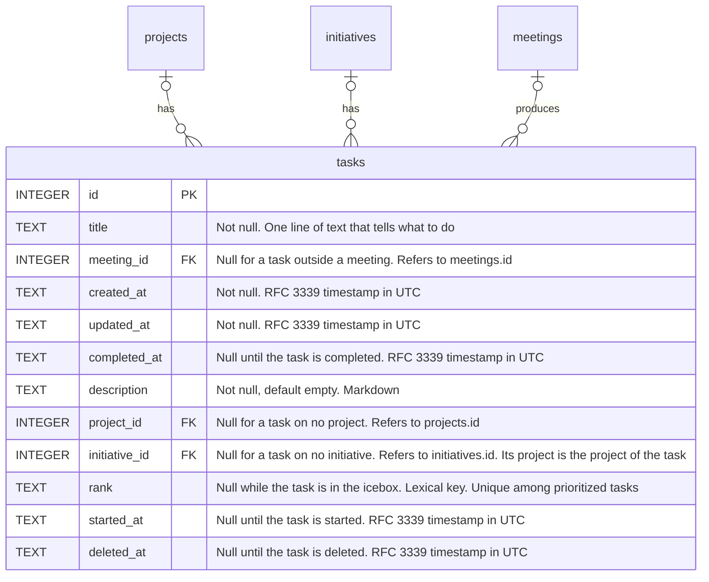

# The Work section

## Situation

When work comes to me from many places, such as action items from meetings, requests in Slack messages, comments in documents, and my own ideas, and today I can only record a task as an action item inside a meeting

## Motivation

I want one place where every task I must do waits until I decide when to do it, where I keep my prioritized tasks in one ordered list, and where I can see what I have started and what I have finished

## Outcome

So I can capture a task quickly, wherever it comes from, without deciding its priority at that moment
So I can always see the next piece of work to start, because it is at the top of my backlog
So I can see what I am working on now, and not start too many things at once
So I can add the details that a task needs before I start it, such as the context of a request and links to documents
So I can see the tasks of a project or an initiative, and look back at what I completed for it

## Acceptance criteria

### The section

- A new Work section in the sidebar shows my tasks in four stages: Icebox, Backlog, Current, and Done.
- The Icebox holds new tasks that I have not prioritized yet, the newest first. It has no order of its own.
- Backlog and Current are one ordered list. Current holds the tasks in that list that I have started, and Backlog holds the tasks that I have not started. The task at the top of the Backlog is the next piece of work to start.
- Done holds the tasks that I have completed, the task that I completed last first.
- Each task shows its title and the name of its project when it has one.

### Creating tasks

- I can create a task from the Work section. It goes to the Icebox.
- An action item that I add in a meeting is a task. It goes to the Icebox too, and it keeps its link to the meeting.
- When I create a task in a meeting, it gets the project of the meeting. If the meeting covers exactly one initiative, the task gets that initiative too. I can change both later.

### Moving tasks

- I can prioritize a task by dragging it from the Icebox into the Backlog, at the place where I drop it.
- I can drag a task to another place in the Backlog, and in the same way reorder the tasks in Current.
- I can start a task by pressing its "Start" button. It moves to Current and keeps its place in the list.
- I can complete a task from any stage by dragging it to Done.
- I can reopen a completed task. It returns to the place that it held: to Current if I had started it, to the Backlog if I had prioritized it, and to the Icebox if I had not. If another task has taken its place, it goes directly after that task.
- I can drag a task from the Backlog or Current back to the Icebox. It is no longer prioritized or started.
- Checking off an action item in a meeting completes the task, wherever it is. Unchecking it reopens the task. The Work section and the meeting always agree.

### Editing tasks

- I edit a task in a sheet, as I edit an initiative. The sheet shows the title, the description, the project, the initiative, and the meeting that the task came from, if any. From the sheet I can open that meeting.
- I write the description of a task in the same Markdown editor that meetings, initiatives, and projects use. Links in the description can be opened.
- I can choose the project of a task, or no project. I can choose an initiative of that project, or no initiative. When I choose an initiative, the task gets the project of that initiative.
- When I change the project of a task to a project that its initiative does not belong to, the task no longer has that initiative.
- When I move an initiative to another project, its tasks move to that project too.
- Deleted projects and deleted initiatives are not offered. A task keeps a project or an initiative that is deleted after I chose it.

### Deleting tasks

- I can delete a task from the Work section and from a meeting. Deleting can be undone, as it can for meetings and initiatives. Today, deleting an action item removes it permanently.
- When I undo the delete, the task returns to the stage and the place that it held.

### Other pages

- The project page lists the tasks of the project that are not completed, in the order of the Backlog, followed by the tasks in the Icebox. From the page I can open each task.
- The initiative sheet lists the tasks of the initiative in the same way.
- A project may not be deleted as long as it has tasks associated with it.

### Existing data

- Existing action items become tasks in the Icebox, and completed action items become tasks in Done.
- Each existing task gets the project of its meeting. If its meeting covers exactly one initiative, the task gets that initiative too.
- `docs/data-model.md` shows the new columns.

## Draft data model

The stage of a task is derived from its columns, as "How tasks move" in `docs/target-data-model.md` describes. There is no stage column. The unique index for ranks covers the prioritized tasks only: `WHERE rank IS NOT NULL AND completed_at IS NULL AND deleted_at IS NULL`.
