# Target data model

This document describes the data model that the application is expected to grow into. It records the outcome of a design conversation on 2026-09-27, in which we described the system that the application models and worked out the tables that will hold it.

It is a guide for writing tickets, not a specification. `data-model.md` describes the database as it is today and stays the authority for every table that exists. Each part of this model reaches the database through the normal process: a ticket in `docs/features`, ADRs for the decisions, specs, a plan, and migrations. Where this document differs from an accepted ADR, the ticket that makes the change needs a superseding ADR. The section "Changes from the current database" lists these differences.

## The system that we model

The user is one employee of a company. The application is their personal record of their work. Nothing in it is shared with other people.

- The company runs **projects**. A project is a long lived effort, such as a product area or a platform. The user works on a small number of projects over their employment. Projects rarely end. Instead, they go into a maintenance mode.
- A project has **initiatives**: specific outcomes that the project must reach, such as a launch or a migration. The user has a **responsibility** in an initiative, expressed as a role from the RACI model: Responsible, Accountable, Consulted, or Informed. An initiative with no role is one that the user knows about but has no responsibility in yet. The user sequences their initiatives on one roadmap across all projects, with the columns Now, Next, and Later. A fourth column, Done, holds the completed ones.
- The user has **objectives** for a period, usually a calendar year, in the OKR style (objectives and key results). Each objective has key results, written as text. An initiative can serve one objective, so that completed initiatives can be traced back to the objectives they served.
- The user attends **meetings**. A meeting is about at most one project, and covers zero or more of that project's initiatives. A meeting about a young project, before it has initiatives and before the user has a responsibility in it, is normal. A meeting can also be about no project, such as a 1:1 or an all hands. The user records notes for every meeting, and who attended.
- The user has **tasks**. A task can come out of a meeting, arrive from outside the application, such as a Slack message or a comment in a document, or be the user's own idea. A task may belong to a project, to an initiative and through it to a project, or to neither. All tasks are prioritized in one backlog, in the style of Pivotal Tracker: a new task waits in an icebox until the user prioritizes it, the backlog is one ordered list, and the task at the top is the next piece of work to start.
- A **directory** of people holds the colleagues who attend meetings and the stakeholders of projects.
- A **glossary** holds the company's terms and their definitions.

## Diagram

```mermaid
erDiagram
    projects {
        INTEGER id PK "Identifier that SQLite assigns"
        TEXT name "Not null, default empty. Trimmed. Unique without regard to case among projects that are not deleted"
        TEXT description "Not null, default empty. Markdown"
        TEXT created_at "Not null. RFC 3339 timestamp in UTC"
        TEXT updated_at "Not null. RFC 3339 timestamp in UTC"
        TEXT deleted_at "Null until the project is deleted"
    }
    people {
        INTEGER id PK "Identifier that SQLite assigns"
        TEXT name "Not null, default empty. Trimmed"
        TEXT title "Not null, default empty. Job title"
        TEXT team "Not null, default empty"
        TEXT email "Not null, default empty"
        TEXT notes "Not null, default empty. Markdown"
        TEXT created_at "Not null. RFC 3339 timestamp in UTC"
        TEXT updated_at "Not null. RFC 3339 timestamp in UTC"
        TEXT deleted_at "Null until the person is deleted"
    }
    project_people {
        INTEGER project_id FK "Part of the primary key. Refers to projects.id"
        INTEGER person_id FK "Part of the primary key. Refers to people.id"
        TEXT role "Not null, default empty. Free text, such as Sponsor"
        TEXT created_at "Not null. RFC 3339 timestamp in UTC"
    }
    objectives {
        INTEGER id PK "Identifier that SQLite assigns"
        TEXT name "Not null, default empty. Trimmed"
        TEXT description "Not null, default empty. Markdown"
        TEXT period_start "Not null. Calendar date, YYYY-MM-DD"
        TEXT period_end "Not null. Calendar date, YYYY-MM-DD"
        TEXT created_at "Not null. RFC 3339 timestamp in UTC"
        TEXT updated_at "Not null. RFC 3339 timestamp in UTC"
        TEXT deleted_at "Null until the objective is deleted"
    }
    key_results {
        INTEGER id PK "Identifier that SQLite assigns"
        INTEGER objective_id FK "Not null. Refers to objectives.id"
        TEXT description "Not null, default empty. One line of text"
        TEXT rank "Not null. Lexical key. Unique within the objective among key results that are not deleted"
        TEXT created_at "Not null. RFC 3339 timestamp in UTC"
        TEXT updated_at "Not null. RFC 3339 timestamp in UTC"
        TEXT deleted_at "Null until the key result is deleted"
    }
    initiatives {
        INTEGER id PK "Identifier that SQLite assigns"
        INTEGER project_id FK "Not null. Refers to projects.id. Does not change after creation"
        INTEGER objective_id FK "Null for an initiative that serves no objective. Refers to objectives.id"
        TEXT name "Not null, default empty. Trimmed. Unique without regard to case within the project among initiatives that are not deleted"
        TEXT description "Not null, default empty. Markdown"
        TEXT raci_role "Null until the user chooses a role. responsible, accountable, consulted, or informed"
        TEXT horizon "Not null, default later. now, next, or later"
        TEXT rank "Not null. Lexical key. Unique within the horizon among initiatives on the board"
        TEXT created_at "Not null. RFC 3339 timestamp in UTC"
        TEXT updated_at "Not null. RFC 3339 timestamp in UTC"
        TEXT completed_at "Null until the initiative is completed"
        TEXT deleted_at "Null until the initiative is deleted"
    }
    meetings {
        INTEGER id PK "Identifier that SQLite assigns"
        INTEGER project_id FK "Null for a meeting about no project. Refers to projects.id"
        TEXT name "Not null. New meetings get Untitled meeting"
        TEXT date "Not null. Calendar date, YYYY-MM-DD"
        TEXT notes "Not null, default empty. Markdown"
        TEXT created_at "Not null. RFC 3339 timestamp in UTC"
        TEXT updated_at "Not null. RFC 3339 timestamp in UTC"
        TEXT deleted_at "Null until the meeting is deleted"
    }
    meeting_initiatives {
        INTEGER meeting_id FK "Part of the primary key. Refers to meetings.id"
        INTEGER initiative_id FK "Part of the primary key. Refers to initiatives.id. Belongs to the project of the meeting"
        TEXT created_at "Not null. RFC 3339 timestamp in UTC"
    }
    meeting_people {
        INTEGER meeting_id FK "Part of the primary key. Refers to meetings.id"
        INTEGER person_id FK "Part of the primary key. Refers to people.id"
        TEXT created_at "Not null. RFC 3339 timestamp in UTC"
    }
    tasks {
        INTEGER id PK "Identifier that SQLite assigns"
        TEXT title "Not null. One line of text that tells what to do"
        TEXT description "Not null, default empty. Markdown"
        INTEGER meeting_id FK "Null for a task outside a meeting. Refers to meetings.id"
        INTEGER project_id FK "Null for a task on no project. Refers to projects.id"
        INTEGER initiative_id FK "Null for a task on no initiative. Refers to initiatives.id. Its project is the project of the task"
        TEXT rank "Null while the task is in the icebox. Lexical key. Unique among prioritized tasks"
        TEXT created_at "Not null. RFC 3339 timestamp in UTC"
        TEXT updated_at "Not null. RFC 3339 timestamp in UTC"
        TEXT started_at "Null until the task is started"
        TEXT completed_at "Null until the task is completed"
        TEXT deleted_at "Null until the task is deleted"
    }
    glossary_terms {
        INTEGER id PK "Identifier that SQLite assigns"
        TEXT term "Not null, default empty. Trimmed. Unique without regard to case among terms that are not deleted"
        TEXT definition "Not null, default empty. Markdown"
        TEXT created_at "Not null. RFC 3339 timestamp in UTC"
        TEXT updated_at "Not null. RFC 3339 timestamp in UTC"
        TEXT deleted_at "Null until the term is deleted"
    }

    projects ||--o{ initiatives : "has"
    projects |o--o{ meetings : "is the subject of"
    projects |o--o{ tasks : "has"
    projects ||--o{ project_people : "has stakeholders"
    people ||--o{ project_people : "is a stakeholder of"
    objectives ||--o{ key_results : "has"
    objectives |o--o{ initiatives : "is served by"
    meetings ||--o{ meeting_initiatives : "covers"
    initiatives ||--o{ meeting_initiatives : "is covered by"
    meetings ||--o{ meeting_people : "has attendees"
    people ||--o{ meeting_people : "attends"
    meetings |o--o{ tasks : "produces"
    initiatives |o--o{ tasks : "has"
```

## Conventions

These rules apply to every table unless the table says otherwise. Most of them are the rules of the current tables, so that the new tables feel like the old ones.

- `id` is an `INTEGER PRIMARY KEY` that SQLite assigns.
- `created_at` and `updated_at` are RFC 3339 timestamps in UTC, and the backend sets them. `updated_at` changes when the user changes the content of a row, such as its name or its text. Moving, starting, completing, deleting, and restoring do not change it, as today (ADR 0008 and ADR 0013).
- Long text, such as notes, descriptions, and definitions, is Markdown (ADR 0004). Names, titles, and terms are one line and are stored without spaces at the start or the end.
- Calendar dates are text in the format `YYYY-MM-DD`, like the date of a meeting.
- The database enforces foreign keys (ADR 0010). No reference has an `ON DELETE` action, because rows that other rows refer to are never removed.

### Deleting

Every row that holds content the user wrote has a column `deleted_at`. It is `NULL` until the user deletes the row. Deleting sets it to the current time and hides the row. The user can undo the delete, which clears it. Rows are never removed, so links to them stay valid, and a later page can show deleted rows.

Today this column is named `archived_at`, and the meetings page calls the action "Archive". The target name is `deleted_at`, because that is what the column records. Words in the user interface are decided by each feature.

Join rows, such as an attendee of a meeting, are links and not content. Removing a link removes the row for real.

### Uniqueness

Every unique constraint is a partial unique index that leaves out deleted rows, with `WHERE deleted_at IS NULL`. The application has no page that shows deleted rows and no way to change them after the undo has gone. Without this rule, a deleted row could hold a value that a live row needs, and the user could not free it.

Names and terms are compared without regard to case, with `COLLATE NOCASE`, and an empty name never conflicts, so that a draft can be saved before it has a name. These are the rules of the initiatives table today (ADR 0013).

### Order

Where the user orders rows by dragging, the order is a text column `rank` that holds a lexical key. This scheme is also called fractional indexing.

- SQLite compares texts byte by byte, so rows sorted by `rank` are in the user's order.
- Between any two keys there is always a key that sorts between them. There is always a key before the first and a key after the last.
- When the user drops a card, the backend reads the keys of the two neighbors at the drop point and generates a key between them. Only the dropped row is written. The frontend keeps sending the destination and the index of the drop, as it does today. It never computes keys.
- A key gets longer only when the user drops into the same gap again and again. If the keys of a scope get long, the backend can give the whole scope fresh short keys in one transaction. This is a maintenance step, and it is not part of a move.
- Because a move writes one row, a partial unique index on the scope and the rank can enforce that no two rows share a place. This was not possible with renumbering, which shifts many rows in one statement.

This replaces the dense integer positions with renumbering that ADR 0013 chose. The ADR rejected fractional keys because they cannot be read by a person. We now prefer them because a move writes one row and the database can enforce the order.

## Tables

### `projects`

A project is a long lived effort of the company that the user works on.

- `name` is unique among projects that are not deleted. A project can be a draft with an empty name, as an initiative can today.
- A project has no `completed_at`. The user works on few projects, and they go into maintenance instead of ending. If a project must leave the lists one day, the user deletes it.
- The project page can list the initiatives, meetings, tasks, and stakeholders of the project, because each of them refers to the project.

### `people`

A person is a colleague. The directory lists them.

- Nothing in this table is unique. Two people can have the same name.
- `title` is the job title. `team` is the team or the department. `email` is for reference; the application does not send mail.
- The user is not a row in this table. The application has one user, and "my role" in an initiative is a column of the initiative.

### `project_people`

A stakeholder of a project: a person attached to the project as a whole.

- The primary key is the pair of `project_id` and `person_id`, so a person is a stakeholder of a project once.
- `role` is free text such as "Sponsor" or "Tech lead". It is not a RACI role. The RACI model describes the user's own responsibility in an initiative, and no other person's.

### `objectives`

An objective of the user for a period, in the OKR style.

- `period_start` and `period_end` are the first and the last day of the period. The period is usually a calendar year, but two dates also allow a quarter or a half year.
- Nothing in this table is unique. The same words can be an objective in two periods.
- Objectives are listed by period, the newest first. They have no rank.

### `key_results`

A key result of an objective: one measurable statement, as text.

- `objective_id` is not null. A key result belongs to one objective.
- `rank` orders the key results within their objective. It is unique within the objective among key results that are not deleted.
- A key result has no numbers and no completion. Progress toward an objective is read off its completed initiatives. Numbers can be added later with a migration.

### `initiatives`

An initiative is a specific outcome of a project that the user has, or may get, a responsibility in. The roadmap shows initiatives as cards (ADR 0013).

- `project_id` is not null, and it does not change after the initiative is created. The user does not need to move initiatives between projects. This keeps the rule for meetings simple: an initiative that a meeting covers always belongs to the project of the meeting.
- `objective_id` is null for an initiative that serves no objective. An initiative serves at most one objective.
- `name` is unique within the project among initiatives that are not deleted. Today it is unique across all initiatives. Two projects can each have an initiative named "Launch".
- `raci_role`, `horizon`, `completed_at`, and `deleted_at` keep their meanings from `data-model.md`.
- `rank` replaces `position`. An initiative is on the board when both `completed_at` and `deleted_at` are null. `rank` is unique within the horizon among initiatives on the board. A completed or deleted initiative keeps its horizon and rank, so that a restore can put it back where it was. If its rank is taken by then, the backend gives it the next free key after the row that holds it.
- The roadmap stays one board across all projects. A card shows its project, and the board can be filtered by project.

### `meetings`

A meeting and its notes.

- `project_id` is null for a meeting about no project. A meeting is about at most one project.
- `initiative_id` is gone. The initiatives that a meeting covers are rows of `meeting_initiatives`.
- When the user changes the project of a meeting, the backend removes the rows of `meeting_initiatives` for that meeting, because they belong to the old project.
- `deleted_at` replaces `archived_at`.

### `meeting_initiatives`

An initiative that a meeting covers. A meeting covers zero or more initiatives.

- The primary key is the pair of `meeting_id` and `initiative_id`.
- The initiative belongs to the project of the meeting. The backend checks this when it adds the row.
- The user interface offers only the initiatives of the meeting's project, including completed ones. Deleted initiatives are not offered. A row that refers to an initiative that was deleted later stays, so the meeting keeps its history.

### `meeting_people`

An attendee of a meeting.

- The primary key is the pair of `meeting_id` and `person_id`.
- The user is not an attendee, because the user is not a row of `people`.

### `tasks`

A task is one piece of work that the user must do. In a meeting, the user interface calls a task an action item (ADR 0010).

- `title` is the one line of text that tells what to do. ADR 0018 renamed it from `description`. `description` is new and holds Markdown, for the definition that the user adds while a task waits in the icebox.
- `meeting_id` is null for a task outside a meeting. The meeting is where the task was recorded. It says nothing about the project or the initiative of the task.
- `project_id` and `initiative_id` are both stored. When `initiative_id` is set, `project_id` is the project of that initiative, and the backend sets it. Storing both makes "all tasks of this project" one condition. When the user changes the project of a task to a project that its initiative does not belong to, the backend clears `initiative_id`. When the user creates a task in a meeting, the user interface offers the meeting's project and initiatives as defaults.
- `rank` is null while the task is in the icebox. It is unique among prioritized tasks. See "How tasks move".
- `started_at` is set when the user starts the task, and cleared when the user undoes that.
- `completed_at` keeps its meaning. Checking a task off in a meeting completes it, wherever it is in the backlog.
- `deleted_at` is new. Today a task is deleted for real. In the target model a task is deleted like everything else, with undo.
- Nothing records where a task from outside the application came from, other than what the user writes in `description`.

### `glossary_terms`

A term of the company and its definition.

- `term` is unique among terms that are not deleted.
- Terms are listed in alphabetical order. They have no rank and no link to other tables.

## How tasks move

The stage of a task is derived from its columns. There is no stage column.

| Stage   | Columns                                                         | Shown                                            |
| ------- | --------------------------------------------------------------- | ------------------------------------------------ |
| Icebox  | `rank` is null, not started, not completed, not deleted         | Newest first, by `created_at`                    |
| Backlog | `rank` is set, `started_at` is null, not completed, not deleted | By `rank`                                        |
| Current | `rank` is set, `started_at` is set, not completed, not deleted  | By `rank`                                        |
| Done    | `completed_at` is set, not deleted                              | The task completed last first, by `completed_at` |
| Deleted | `deleted_at` is set                                             | Not shown                                        |

- A **new task** goes to the icebox, wherever it is created: in a meeting, from a page of the application, or by itself. The icebox is where the user prioritizes it and, if needed, defines it further. The icebox has no order of its own.
- **Prioritizing** a task moves it from the icebox into the backlog. It gets a rank at the drop point, or at the bottom when the user does not drop it at a place. A task in the backlog or in Current is a **prioritized** task.
- Backlog and Current are **one sequence**, ordered by `rank`. Current is that sequence filtered to started tasks. The next piece of work to start is always the first task in the sequence that is not started.
- **Starting** a task sets `started_at`. It does not change the rank.
- **Completing** a task sets `completed_at`. The task keeps its rank, so that reopening puts it back where it was. If its rank is taken by then, the backend gives it the next free key after the row that holds it. A reopened task keeps `started_at`, so a task that was started returns to Current. A reopened task whose rank is null returns to the icebox.
- **Dragging** a task back to the icebox clears its rank and `started_at`.
- **Deleting** a task sets `deleted_at`. The other columns stay, so that undo puts the task back in its stage.

The unique index for ranks covers the prioritized tasks only: `WHERE rank IS NOT NULL AND completed_at IS NULL AND deleted_at IS NULL`.

## Rules that the backend keeps

The backend owns all writes (ADR 0003), so it keeps the rules that SQLite cannot express as a constraint. Each rule is kept inside one transaction and tested in the module that owns the table.

1. An initiative that a meeting covers belongs to the project of the meeting. Adding a row to `meeting_initiatives` checks this. Changing the project of a meeting removes its rows.
2. A task on an initiative has the project of that initiative. Setting `initiative_id` sets `project_id`. Changing `project_id` clears an `initiative_id` that belongs to another project.
3. An initiative does not change its project after creation.
4. Ranks are unique within their scope among the rows that the user can see in that scope: initiatives per horizon on the board, prioritized tasks as one sequence, key results per objective. A partial unique index enforces each of these.
5. Restoring a row whose rank is taken gives it the next free key after the row that holds it.
6. Names and terms are trimmed before they are compared and written, and a taken name is reported as a result, not as an error (ADR 0013).

## Changes from the current database

For each table that exists today, this section lists what changes. Each change needs its own ticket and migration, and the ADRs named here would be superseded.

### Every table with `archived_at`

`archived_at` becomes `deleted_at` in `meetings` and `initiatives`. SQLite renames a column with `ALTER TABLE ... RENAME COLUMN` and updates the partial indexes that use it. The names of the backend commands and of the frontend functions follow the column. This supersedes the naming in ADR 0008 and ADR 0013.

### `initiatives`

- `position` becomes `rank`, a text column. The migration generates keys in the current order of each column. The renumbering in ADR 0013 goes away, and a partial unique index on `(horizon, rank)` for initiatives on the board is added. This supersedes the order part of ADR 0013.
- `project_id` is added, not null. The migration must give the existing initiatives a project, and because the project of an initiative cannot change, the ticket for projects must decide how. Two ways: the migration creates a placeholder project, and the user recreates the few existing initiatives in their real projects; or the column is added as nullable first, the user gives each initiative a project in the user interface, and a later migration makes the column not null.
- `objective_id` is added, nullable.
- The unique index on the name becomes an index on `(project_id, name COLLATE NOCASE)`, still limited to rows that are not deleted and have a name. This supersedes the unique names part of ADR 0013.

### `meetings`

- `project_id` is added, nullable.
- `initiative_id` goes away. The migration copies each meeting's initiative into `meeting_initiatives` and sets `project_id` to the project of that initiative. SQLite cannot drop a column that a foreign key or an index uses, so the migration rebuilds the table. This supersedes the one initiative per meeting in ADR 0013.

### `tasks`

- `description`, `project_id`, `initiative_id`, `rank`, `started_at`, and `deleted_at` are added.
- Existing tasks get a null rank, so they start in the icebox, unless the ticket decides to place the open ones in the backlog in the order they were created.
- The migration can set `initiative_id` and `project_id` of a task from the initiative of its meeting, if the ticket decides so.
- Deleting a task no longer removes the row. This supersedes the permanent delete in ADR 0010.

### New tables

`projects`, `people`, `project_people`, `objectives`, `key_results`, `meeting_initiatives`, `meeting_people`, and `glossary_terms`.

## Left out on purpose

These were considered and are not part of the target model. Each can be added later with a migration.

- Numeric progress on key results, and links from initiatives to key results instead of objectives.
- RACI roles for other people on an initiative. The RACI role is the user's own.
- The person who gave the user a task. What the user writes in the `description` of the task is enough.
- A RACI role for the user on a project as a whole. Responsibility lives on initiatives.
- Moving an initiative to another project.
- An order of the user's own in the icebox.
- `completed_at` on projects.
- Points, velocity, iterations, and the finished, delivered, and accepted states of Pivotal Tracker. The backlog borrows the icebox, the single ordered list, and the "top is next" rule only.
- A meeting about several projects.

## A possible order of tickets

Each step is releasable on its own. The order is a suggestion.

1. Rename `archived_at` to `deleted_at`, and replace positions with ranks. Neither changes what the user sees.
2. Projects, with initiatives in projects and meetings about projects.
3. Meetings that cover several initiatives.
4. The Work section: icebox, backlog, Current, and Done, with descriptions and links on tasks.
5. The directory: people, attendees, and stakeholders.
6. Objectives and key results.
7. The glossary.
